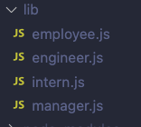
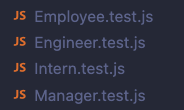
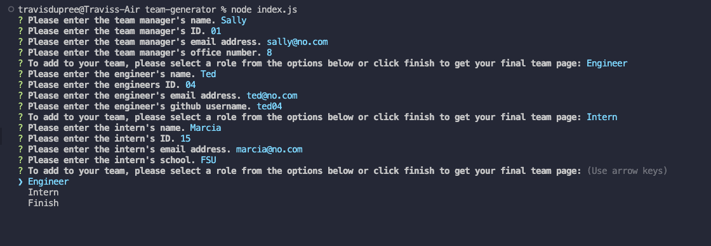

# Team Generator

## Goals

The goal of this project is to build a Node.js command-line application that takes in information about employees on a software engineering team, then generates an HTML webpage that displays summaries for each person. A secondary goal is to also write a unit test for every part of the code to ensure that it passes each test. It is considered done when: 

- When the application starts, a user is prompted to enter the team manager's name, employee ID, email address, and office number.

- Then, the user is presented with options to add other team members either as Engineers or Interns. They are also presented with the opition to complete and receive a completed HTML at this point. 

- Once all team members are added the user is able to complete the input and this will generate a HTML file which displays the individual team members added. 

- Additionally, once the completed HTML page is opened, the user will be able to click on the team member's email as well as the GitHub usernames of all Engineers. The email link will open the default email application and the GitHub user name will open the user's page in the browser. 

## Implementation

I initially intended to begin this project following the Test Driven Development format. However, due to my inexperience with this method, development was slow and insufficient for the time I had to complete it. Therefore, I completed the test files at the end, which still proved fruitful in refining my error throwing process. After the pivot, I began by establishing my class object constuctors in their own files and each had an associated test.js file. 

  

I then built out the user input form using Inquirer. I decided to break this input out over four functions. The first, `init()` would collect the required manager information and would then trigger `menu()`. This second funciton serves as a hub in which to add additional users or to complete the team build. The two other inquirer functions `addEngineer()` and `addIntern()` loop back to this `menu()` function. Each new object that is built by user input is pushed to an empty array. Once completed, the user can select finish which will transition to building the HTML file. A screen shot of the user interface and input is below. 

To build the HTML page, I began by creating a template of my staic page and setting it equal to a variable as a template literal. I then used the `.map` function on the array holding my employee objects and, depending on the role, generated a html card div using a second saved template. I then took the resulting array and converted it into a single string using the `.join` method. This final string was then passed to my static template and written to a file using node's FS system. A sceenshot of the resulting webpage is available below. 

You can watch a demo of the application [here](https://drive.google.com/file/d/16aj-oIo6XUKjNrkM2v7e3e8Ughoj7TWM/view) and you can check out the code repo [here](https://github.com/Traveye/team-generator).

## License
MIT

## Credits
NA

## Usage
NA
